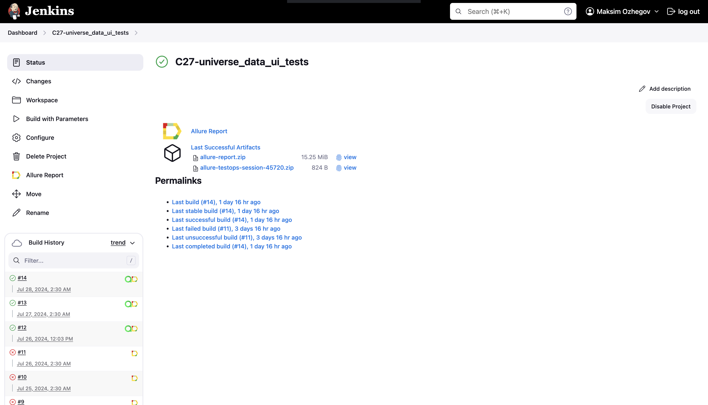
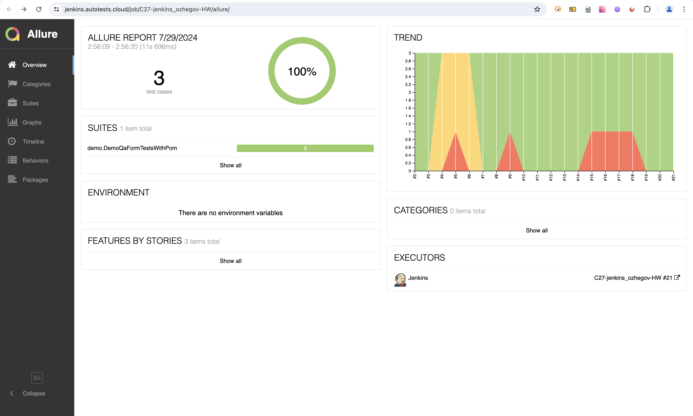
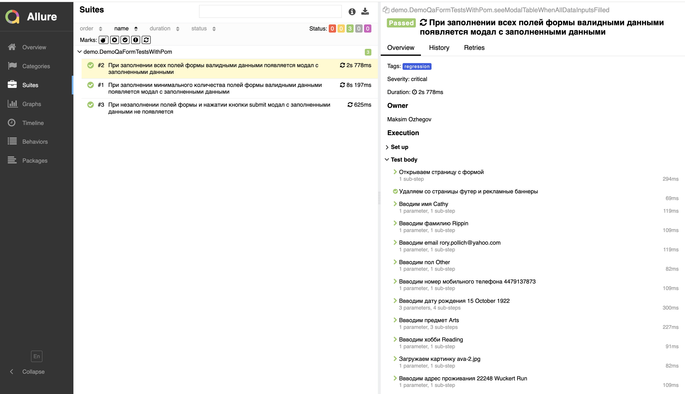
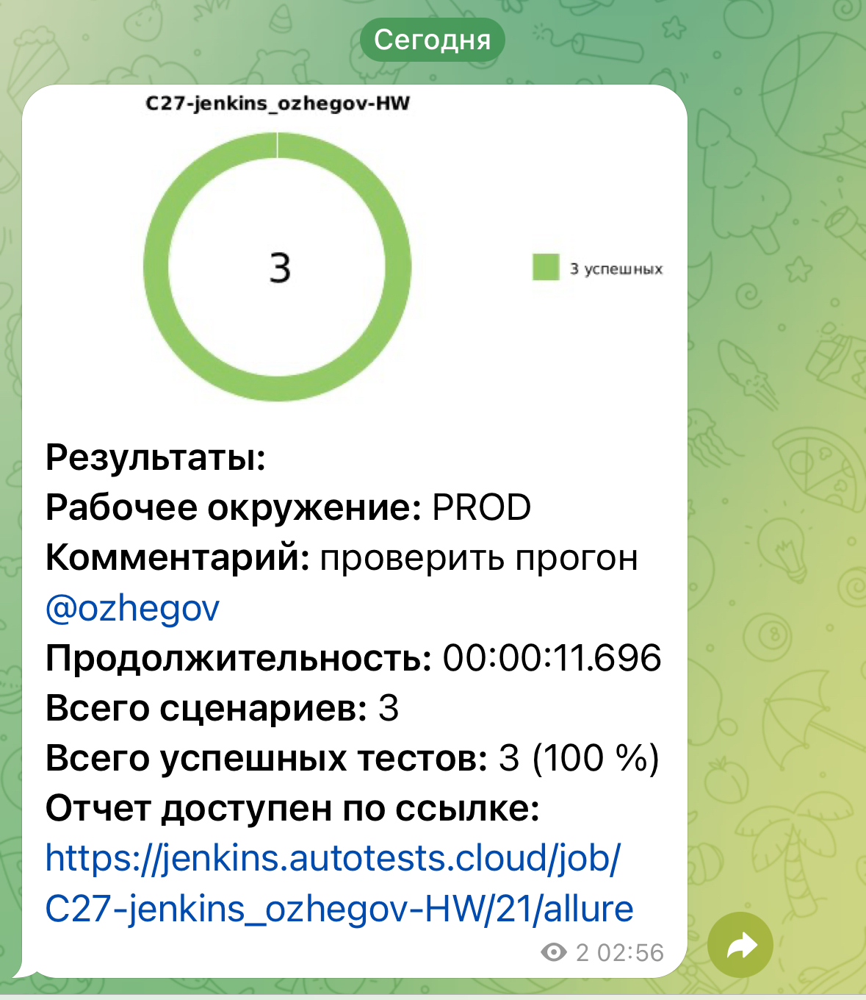

# Запуск автоматизированных тестов в Jenkins </a>

## <a>**Задача:**</a>
1. Разработать автотесты на проверку [формы](https://demoqa.com/automation-practice-form):
- Реализовать тесты на **Page Object Model**
- Использовать аннотации **JUnit5**
- Добавить генерацию тестовых данных с помощью библиотеки **Faker**
3. Добавить в проект **Allure Report** и аттачи для него – скриншот, page source, console.log и видео

4. Настроить запуск теста в **Jenkins**
- Cделать сборку 
- Передать адрес удаленного браузера (**Selenoid**)
- Сделать возможность выбора браузера и разрешения
5. Добавить уведомления о результатах прохождении автотестов с помощью **Telegram-бота**

## </a>Сборка в [Jenkins](https://jenkins.autotests.cloud/job/C27-universe_data_ui_tests/)</a>

  
  

## </a>Интеграция с [Allure Report](https://jenkins.autotests.cloud/job/C27-universe_data_ui_tests/allure/)</a>

### *Основная страница отчёта*

  
  

  

### *Тест-кейсы*

  
  

## </a>Уведомления в Telegram при помощи бота</a>

  
  

